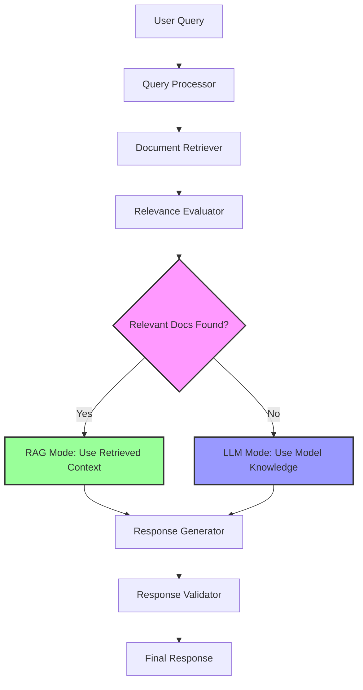

# 🔄 Hybrid RAG Implementation

I'll help you build a Hybrid RAG system that intelligently decides whether to use retrieved documents or rely on the LLM's knowledge based on data availability and relevance.

## 🏗️ **Architecture Overview**



## 📁 **Project Structure**

```
hybrid_rag/
├── src/
│   ├── __init__.py
│   ├── hybrid_rag.py          # Main implementation
│   ├── document_loader.py     # Document loading utilities
│   ├── retriever.py          # Retrieval components
│   ├── evaluator.py          # Relevance evaluation
│   └── utils.py              # Helper functions
├── data/
│   └── documents/            # Your document sources
├── config/
│   └── config.yaml          # Configuration file
├── requirements.txt
└── main.py                  # Entry point
```

## 🛠️ **Implementation**

### **1. Requirements**

```txt
# requirements.txt
langchain==0.1.0
langchain-community==0.0.10
langchain-openai==0.0.5
chromadb==0.4.22
sentence-transformers==2.2.2
openai==1.6.1
python-dotenv==1.0.0
PyPDF2==3.0.1
python-docx==1.1.0
pyyaml==6.0.1
numpy==1.24.3
scikit-learn==1.3.0
```

### **2. Configuration**

```yaml
# config/config.yaml
llm:
  provider: "openai"  # or "huggingface", "anthropic"
  model: "gpt-3.5-turbo"
  temperature: 0.1
  max_tokens: 1000

embeddings:
  model: "sentence-transformers/all-MiniLM-L6-v2"
  
retrieval:
  chunk_size: 1000
  chunk_overlap: 200
  top_k: 5
  similarity_threshold: 0.7

hybrid:
  relevance_threshold: 0.6
  confidence_threshold: 0.8
  fallback_to_llm: true
  combine_sources: true

vector_store:
  type: "chroma"
  persist_directory: "./data/vectorstore"
```

### **3. Document Loader**

```python
# src/document_loader.py
import os
from typing import List, Dict
from pathlib import Path
import PyPDF2
from docx import Document
from langchain.text_splitter import RecursiveCharacterTextSplitter
from langchain.schema import Document as LangchainDocument

class DocumentLoader:
    def __init__(self, chunk_size: int = 1000, chunk_overlap: int = 200):
        self.chunk_size = chunk_size
        self.chunk_overlap = chunk_overlap
        self.text_splitter = RecursiveCharacterTextSplitter(
            chunk_size=chunk_size,
            chunk_overlap=chunk_overlap,
            length_function=len,
        )
    
    def load_documents(self, directory: str) -> List[LangchainDocument]:
        """Load and process documents from directory"""
        documents = []
        directory_path = Path(directory)
        
        if not directory_path.exists():
            print(f"Directory {directory} does not exist")
            return documents
        
        for file_path in directory_path.rglob("*"):
            if file_path.is_file():
                try:
                    content = self._load_file(file_path)
                    if content:
                        # Create document with metadata
                        doc = LangchainDocument(
                            page_content=content,
                            metadata={
                                "source": str(file_path),
                                "filename": file_path.name,
                                "file_type": file_path.suffix
                            }
                        )
                        documents.append(doc)
                        print(f"Loaded: {file_path.name}")
                except Exception as e:
                    print(f"Error loading {file_path}: {e}")
        
        # Split documents into chunks
        if documents:
            documents = self.text_splitter.split_documents(documents)
            print(f"Created {len(documents)} document chunks")
        
        return documents
    
    def _load_file(self, file_path: Path) -> str:
        """Load content from different file types"""
        suffix = file_path.suffix.lower()
        
        if suffix == '.txt':
            return self._load_txt(file_path)
        elif suffix == '.pdf':
            return self._load_pdf(file_path)
        elif suffix in ['.doc', '.docx']:
            return self._load_docx(file_path)
        else:
            print(f"Unsupported file type: {suffix}")
            return ""
    
    def _load_txt(self, file_path: Path) -> str:
        """Load text file"""
        with open(file_path, 'r', encoding='utf-8') as file:
            return file.read()
    
    def _load_pdf(self, file_path: Path) -> str:
        """Load PDF file"""
        text = ""
        with open(file_path, 'rb') as file:
            pdf_reader = PyPDF2.PdfReader(file)
            for page in pdf_reader.pages:
                text += page.extract_text() + "\n"
        return text
    
    def _load_docx(self, file_path: Path) -> str:
        """Load DOCX file"""
        doc = Document(file_path)
        text = ""
        for paragraph in doc.paragraphs:
            text += paragraph.text + "\n"
        return text
```

### **4. Retriever Component**

```python
# src/retriever.py
from typing import List, Tuple
import chromadb
from langchain.vectorstores import Chroma
from langchain.embeddings import HuggingFaceEmbeddings
from langchain.schema import Document
from sentence_transformers import SentenceTransformer
import numpy as np
from sklearn.metrics.pairwise import cosine_similarity

class HybridRetriever:
    def __init__(self, config: dict):
        self.config = config
        self.embeddings = HuggingFaceEmbeddings(
            model_name=config['embeddings']['model']
        )
        self.vector_store = None
        self.similarity_threshold = config['retrieval']['similarity_threshold']
        self.top_k = config['retrieval']['top_k']
        
    def setup_vector_store(self, documents: List[Document]):
        """Initialize vector store with documents"""
        if not documents:
            print("No documents to index")
            return
            
        self.vector_store = Chroma.from_documents(
            documents=documents,
            embedding=self.embeddings,
            persist_directory=self.config['vector_store']['persist_directory']
        )
        self.vector_store.persist()
        print(f"Vector store created with {len(documents)} documents")
    
    def load_vector_store(self):
        """Load existing vector store"""
        try:
            self.vector_store = Chroma(
                embedding_function=self.embeddings,
                persist_directory=self.config['vector_store']['persist_directory']
            )
            print("Vector store loaded successfully")
        except Exception as e:
            print(f"Error loading vector store: {e}")
            self.vector_store = None
    
    def retrieve_documents(self, query: str) -> Tuple[List[Document], List[float]]:
        """Retrieve relevant documents with similarity scores"""
        if not self.vector_store:
            return [], []
        
        try:
            # Retrieve documents with scores
            docs_and_scores = self.vector_store.similarity_search_with_score(
                query, k=self.top_k
            )
            
            if not docs_and_scores:
                return [], []
            
            # Separate documents and scores
            documents = [doc for doc, score in docs_and_scores]
            scores = [score for doc, score in docs_and_scores]
            
            # Filter by similarity threshold
            filtered_docs = []
            filtered_scores = []
            
            for doc, score in zip(documents, scores):
                # Note: Chroma returns distance, lower is better
                similarity = 1 - score  # Convert distance to similarity
                if similarity >= self.similarity_threshold:
                    filtered_docs.append(doc)
                    filtered_scores.append(similarity)
            
            return filtered_docs, filtered_scores
            
        except Exception as e:
            print(f"Error retrieving documents: {e}")
            return [], []
    
    def get_retrieval_stats(self) -> dict:
        """Get statistics about the vector store"""
        if not self.vector_store:
            return {"status": "No vector store available"}
        
        try:
            # Get collection info
            collection = self.vector_store._collection
            count = collection.count()
            
            return {
                "status": "active",
                "document_count": count,
                "similarity_threshold": self.similarity_threshold,
                "top_k": self.top_k
            }
        except Exception as e:
            return {"status": f"Error: {e}"}
```

### **5. Relevance Evaluator**

```python
# src/evaluator.py
from typing import List, Dict, Tuple
from langchain.schema import Document
import numpy as np
from sentence_transformers import SentenceTransformer
from sklearn.metrics.pairwise import cosine_similarity
import re

class RelevanceEvaluator:
    def __init__(self, config: dict):
        self.config = config
        self.relevance_threshold = config['hybrid']['relevance_threshold']
        self.confidence_threshold = config['hybrid']['confidence_threshold']
        self.model = SentenceTransformer(config['embeddings']['model'])
    
    def evaluate_relevance(self, query: str, documents: List[Document], 
                          scores: List[float]) -> Dict:
        """Evaluate if retrieved documents are relevant enough for RAG"""
        if not documents:
            return {
                "is_relevant": False,
                "confidence": 0.0,
                "reason": "No documents retrieved",
                "recommendation": "use_llm"
            }
        
        # Calculate various relevance metrics
        semantic_relevance = self._calculate_semantic_relevance(query, documents)
        keyword_overlap = self._calculate_keyword_overlap(query, documents)
        score_quality = self._evaluate_score_quality(scores)
        
        # Combine metrics
        overall_relevance = (
            semantic_relevance * 0.5 + 
            keyword_overlap * 0.3 + 
            score_quality * 0.2
        )
        
        # Determine recommendation
        is_relevant = overall_relevance >= self.relevance_threshold
        confidence = min(overall_relevance, 1.0)
        
        if is_relevant and confidence >= self.confidence_threshold:
            recommendation = "use_rag"
        elif is_relevant:
            recommendation = "use_hybrid"  # Combine both sources
        else:
            recommendation = "use_llm"
        
        return {
            "is_relevant": is_relevant,
            "confidence": confidence,
            "overall_relevance": overall_relevance,
            "semantic_relevance": semantic_relevance,
            "keyword_overlap": keyword_overlap,
            "score_quality": score_quality,
            "reason": self._get_reason(overall_relevance, confidence),
            "recommendation": recommendation,
            "document_count": len(documents)
        }
    
    def _calculate_semantic_relevance(self, query: str, documents: List[Document]) -> float:
        """Calculate semantic similarity between query and documents"""
        try:
            query_embedding = self.model.encode([query])
            doc_texts = [doc.page_content for doc in documents]
            doc_embeddings = self.model.encode(doc_texts)
            
            similarities = cosine_similarity(query_embedding, doc_embeddings)[0]
            return float(np.mean(similarities))
        except Exception as e:
            print(f"Error calculating semantic relevance: {e}")
            return 0.0
    
    def _calculate_keyword_overlap(self, query: str, documents: List[Document]) -> float:
        """Calculate keyword overlap between query and documents"""
        try:
            query_words = set(re.findall(r'\w+', query.lower()))
            if not query_words:
                return 0.0
            
            overlaps = []
            for doc in documents:
                doc_words = set(re.findall(r'\w+', doc.page_content.lower()))
                if doc_words:
                    overlap = len(query_words.intersection(doc_words)) / len(query_words)
                    overlaps.append(overlap)
            
            return float(np.mean(overlaps)) if overlaps else 0.0
        except Exception as e:
            print(f"Error calculating keyword overlap: {e}")
            return 0.0
    
    def _evaluate_score_quality(self, scores: List[float]) -> float:
        """Evaluate the quality of retrieval scores"""
        if not scores:
            return 0.0
        
        # Higher average score and lower variance indicate better quality
        avg_score = np.mean(scores)
        score_variance = np.var(scores)
        
        # Normalize variance (lower variance is better)
        quality = avg_score * (1 - min(score_variance, 1.0))
        return float(quality)
    
    def _get_reason(self, relevance: float, confidence: float) -> str:
        """Get human-readable reason for the decision"""
        if relevance >= self.relevance_threshold and confidence >= self.confidence_threshold:
            return "High relevance and confidence - using retrieved documents"
        elif relevance >= self.relevance_threshold:
            return "Good relevance but lower confidence - combining sources"
        else:
            return "Low relevance - using LLM knowledge"
```

### **6. Main Hybrid RAG Implementation**

```python
# src/hybrid_rag.py
import os
from typing import Dict, List, Optional, Tuple
from langchain.llms import OpenAI
from langchain.chat_models import ChatOpenAI
from langchain.schema import Document
import yaml
from dotenv import load_dotenv

from .document_loader import DocumentLoader
from .retriever import HybridRetriever
from .evaluator import RelevanceEvaluator

load_dotenv()

class HybridRAG:
    def __init__(self, config_path: str = "config/config.yaml"):
        """Initialize Hybrid RAG system"""
        self.config = self._load_config(config_path)
        self.llm = self._setup_llm()
        self.document_loader = DocumentLoader(
            chunk_size=self.config['retrieval']['chunk_size'],
            chunk_overlap=self.config['retrieval']['chunk_overlap']
        )
        self.retriever = HybridRetriever(self.config)
        self.evaluator = RelevanceEvaluator(self.config)
        self.is_initialized = False
    
    ```python
# src/hybrid_rag.py (continued)
    def _load_config(self, config_path: str) -> dict:
        """Load configuration from YAML file"""
        try:
            with open(config_path, 'r') as file:
                return yaml.safe_load(file)
        except FileNotFoundError:
            print(f"Config file {config_path} not found. Using default config.")
            return self._get_default_config()
    
    def _get_default_config(self) -> dict:
        """Return default configuration"""
        return {
            'llm': {
                'provider': 'openai',
                'model': 'gpt-3.5-turbo',
                'temperature': 0.1,
                'max_tokens': 1000
            },
            'embeddings': {
                'model': 'sentence-transformers/all-MiniLM-L6-v2'
            },
            'retrieval': {
                'chunk_size': 1000,
                'chunk_overlap': 200,
                'top_k': 5,
                'similarity_threshold': 0.7
            },
            'hybrid': {
                'relevance_threshold': 0.6,
                'confidence_threshold': 0.8,
                'fallback_to_llm': True,
                'combine_sources': True
            },
            'vector_store': {
                'type': 'chroma',
                'persist_directory': './data/vectorstore'
            }
        }
    
    def _setup_llm(self):
        """Setup LLM based on configuration"""
        provider = self.config['llm']['provider']
        
        if provider == 'openai':
            return ChatOpenAI(
                model_name=self.config['llm']['model'],
                temperature=self.config['llm']['temperature'],
                max_tokens=self.config['llm']['max_tokens'],
                openai_api_key=os.getenv('OPENAI_API_KEY')
            )
        else:
            raise ValueError(f"Unsupported LLM provider: {provider}")
    
    def initialize_knowledge_base(self, documents_directory: str) -> bool:
        """Load documents and create vector store"""
        print("🔄 Initializing knowledge base...")
        
        # Load documents
        documents = self.document_loader.load_documents(documents_directory)
        
        if not documents:
            print("❌ No documents found to load")
            return False
        
        # Setup vector store
        self.retriever.setup_vector_store(documents)
        self.is_initialized = True
        
        print(f"✅ Knowledge base initialized with {len(documents)} document chunks")
        return True
    
    def load_existing_knowledge_base(self) -> bool:
        """Load existing vector store"""
        print("🔄 Loading existing knowledge base...")
        
        self.retriever.load_vector_store()
        
        if self.retriever.vector_store is None:
            print("❌ No existing knowledge base found")
            return False
        
        self.is_initialized = True
        print("✅ Existing knowledge base loaded successfully")
        return True
    
    def query(self, user_query: str) -> Dict:
        """Main query method - decides between RAG and LLM"""
        print(f"\n🔍 Processing query: {user_query}")
        
        if not self.is_initialized:
            print("⚠️ Knowledge base not initialized, using LLM only")
            return self._llm_response(user_query, "Knowledge base not available")
        
        # Step 1: Retrieve documents
        documents, scores = self.retriever.retrieve_documents(user_query)
        print(f"📄 Retrieved {len(documents)} documents")
        
        # Step 2: Evaluate relevance
        evaluation = self.evaluator.evaluate_relevance(user_query, documents, scores)
        print(f"📊 Relevance evaluation: {evaluation['recommendation']} (confidence: {evaluation['confidence']:.2f})")
        
        # Step 3: Generate response based on evaluation
        if evaluation['recommendation'] == 'use_rag':
            return self._rag_response(user_query, documents, evaluation)
        elif evaluation['recommendation'] == 'use_hybrid':
            return self._hybrid_response(user_query, documents, evaluation)
        else:
            return self._llm_response(user_query, evaluation['reason'])
    
    def _rag_response(self, query: str, documents: List[Document], evaluation: Dict) -> Dict:
        """Generate response using retrieved documents only"""
        print("🤖 Generating RAG response...")
        
        # Prepare context from documents
        context = self._prepare_context(documents)
        
        # Create RAG prompt
        prompt = f"""Based on the following context, answer the question. If the context doesn't contain enough information to answer the question, say so.

Context:
{context}

Question: {query}

Answer:"""
        
        try:
            response = self.llm.predict(prompt)
            
            return {
                'answer': response,
                'mode': 'RAG',
                'confidence': evaluation['confidence'],
                'sources': [doc.metadata.get('source', 'Unknown') for doc in documents],
                'evaluation': evaluation,
                'context_used': True
            }
        except Exception as e:
            print(f"❌ Error generating RAG response: {e}")
            return self._llm_response(query, "Error in RAG generation")
    
    def _hybrid_response(self, query: str, documents: List[Document], evaluation: Dict) -> Dict:
        """Generate response combining retrieved documents and LLM knowledge"""
        print("🔄 Generating hybrid response...")
        
        # Get RAG response
        context = self._prepare_context(documents)
        rag_prompt = f"""Based on the following context, provide what information you can find:

Context:
{context}

Question: {query}

Information from context:"""
        
        try:
            rag_part = self.llm.predict(rag_prompt)
            
            # Get LLM response
            llm_prompt = f"""The following question was partially answered using retrieved documents, but may need additional information from your knowledge:

Question: {query}

Partial answer from documents: {rag_part}

Please provide a complete answer, combining the document information with your knowledge where needed:"""
            
            final_response = self.llm.predict(llm_prompt)
            
            return {
                'answer': final_response,
                'mode': 'HYBRID',
                'confidence': evaluation['confidence'],
                'sources': [doc.metadata.get('source', 'Unknown') for doc in documents],
                'evaluation': evaluation,
                'context_used': True,
                'rag_part': rag_part
            }
        except Exception as e:
            print(f"❌ Error generating hybrid response: {e}")
            return self._llm_response(query, "Error in hybrid generation")
    
    def _llm_response(self, query: str, reason: str) -> Dict:
        """Generate response using LLM knowledge only"""
        print("🧠 Generating LLM response...")
        
        prompt = f"""Answer the following question using your knowledge:

Question: {query}

Answer:"""
        
        try:
            response = self.llm.predict(prompt)
            
            return {
                'answer': response,
                'mode': 'LLM',
                'confidence': 0.7,  # Default confidence for LLM responses
                'sources': ['LLM Knowledge'],
                'reason': reason,
                'context_used': False
            }
        except Exception as e:
            return {
                'answer': f"Error generating response: {e}",
                'mode': 'ERROR',
                'confidence': 0.0,
                'sources': [],
                'context_used': False
            }
    
    def _prepare_context(self, documents: List[Document]) -> str:
        """Prepare context string from documents"""
        context_parts = []
        for i, doc in enumerate(documents, 1):
            source = doc.metadata.get('filename', 'Unknown')
            content = doc.page_content.strip()
            context_parts.append(f"[Source {i}: {source}]\n{content}")
        
        return "\n\n".join(context_parts)
    
    def get_system_status(self) -> Dict:
        """Get system status and statistics"""
        retrieval_stats = self.retriever.get_retrieval_stats()
        
        return {
            'initialized': self.is_initialized,
            'config': self.config,
            'retrieval_stats': retrieval_stats,
            'llm_model': self.config['llm']['model']
        }
```

### **7. Utility Functions**

```python
# src/utils.py
import os
from typing import Dict, Any
import json
from datetime import datetime

def create_directories():
    """Create necessary directories"""
    directories = [
        'data/documents',
        'data/vectorstore',
        'config',
        'logs'
    ]
    
    for directory in directories:
        os.makedirs(directory, exist_ok=True)
        print(f"📁 Created directory: {directory}")

def log_query(query: str, response: Dict, log_file: str = "logs/query_log.json"):
    """Log query and response for analysis"""
    log_entry = {
        'timestamp': datetime.now().isoformat(),
        'query': query,
        'response_mode': response.get('mode', 'Unknown'),
        'confidence': response.get('confidence', 0.0),
        'sources_count': len(response.get('sources', [])),
        'context_used': response.get('context_used', False)
    }
    
    # Append to log file
    try:
        if os.path.exists(log_file):
            with open(log_file, 'r') as f:
                logs = json.load(f)
        else:
            logs = []
        
        logs.append(log_entry)
        
        with open(log_file, 'w') as f:
            json.dump(logs, f, indent=2)
    except Exception as e:
        print(f"Error logging query: {e}")

def print_response(response: Dict):
    """Pretty print response"""
    print("\n" + "="*60)
    print(f"🤖 MODE: {response['mode']}")
    print(f"📊 CONFIDENCE: {response['confidence']:.2f}")
    print(f"📚 SOURCES: {', '.join(response['sources'])}")
    print("="*60)
    print(f"💬 ANSWER:\n{response['answer']}")
    print("="*60)
    
    if 'evaluation' in response:
        eval_data = response['evaluation']
        print(f"📈 EVALUATION:")
        print(f"   - Relevance: {eval_data.get('overall_relevance', 0):.2f}")
        print(f"   - Reason: {eval_data.get('reason', 'N/A')}")
        print(f"   - Documents: {eval_data.get('document_count', 0)}")
```

### **8. Main Execution Script**

```python
# main.py
import os
from dotenv import load_dotenv
from src.hybrid_rag import HybridRAG
from src.utils import create_directories, log_query, print_response

load_dotenv()

def main():
    """Main execution function"""
    print("🚀 Starting Hybrid RAG System")
    print("="*50)
    
    # Create necessary directories
    create_directories()
    
    # Initialize Hybrid RAG
    rag_system = HybridRAG()
    
    # Check if knowledge base exists, otherwise create it
    if not rag_system.load_existing_knowledge_base():
        print("\n📚 No existing knowledge base found. Creating new one...")
        documents_dir = "data/documents"
        
        if not os.path.exists(documents_dir) or not os.listdir(documents_dir):
            print(f"❌ Please add documents to {documents_dir} directory")
            print("Supported formats: .txt, .pdf, .docx")
            return
        
        if not rag_system.initialize_knowledge_base(documents_dir):
            print("❌ Failed to initialize knowledge base")
            return
    
    # Print system status
    status = rag_system.get_system_status()
    print(f"\n📊 System Status:")
    print(f"   - Initialized: {status['initialized']}")
    print(f"   - LLM Model: {status['llm_model']}")
    print(f"   - Documents: {status['retrieval_stats'].get('document_count', 0)}")
    
    # Interactive query loop
    print("\n💬 Ready for queries! (Type 'quit' to exit, 'status' for system info)")
    print("-" * 50)
    
    while True:
        try:
            user_input = input("\n🔍 Enter your question: ").strip()
            
            if user_input.lower() in ['quit', 'exit', 'q']:
                print("👋 Goodbye!")
                break
            
            if user_input.lower() == 'status':
                status = rag_system.get_system_status()
                print(f"\n📊 System Status: {status}")
                continue
            
            if not user_input:
                print("❌ Please enter a valid question")
                continue
            
            # Process query
            response = rag_system.query(user_input)
            
            # Display response
            print_response(response)
            
            # Log query
            log_query(user_input, response)
            
        except KeyboardInterrupt:
            print("\n👋 Goodbye!")
            break
        except Exception as e:
            print(f"❌ Error: {e}")

def demo_queries():
    """Run demo with sample queries"""
    rag_system = HybridRAG()
    
    # Load or create knowledge base
    if not rag_system.load_existing_knowledge_base():
        if not rag_system.initialize_knowledge_base("data/documents"):
            print("❌ Cannot run demo without knowledge base")
            return
    
    # Sample queries
    demo_questions = [
        "What is machine learning?",
        "How does photosynthesis work?",
        "What are the company policies mentioned in the documents?",
        "Explain quantum computing",
        "What is the weather like today?"
    ]
    
    print("🎯 Running Demo Queries")
    print("="*50)
    
    for question in demo_questions:
        print(f"\n🔍 Demo Query: {question}")
        response = rag_system.query(question)
        print_response(response)
        print("\n" + "-"*30)

if __name__ == "__main__":
    # Check for required environment variables
    if not os.getenv('OPENAI_API_KEY'):
        print("❌ Please set OPENAI_API_KEY environment variable")
        print("Create a .env file with: OPENAI_API_KEY=your_api_key_here")
        exit(1)
    
    # Run main application
    main()
    
    # Uncomment to run demo instead
    # demo_queries()
```

### **9. Environment Setup**

```bash
# .env
OPENAI_API_KEY=your_openai_api_key_here
# Add other API keys as needed
# ANTHROPIC_API_KEY=your_anthropic_key
# HUGGINGFACE_API_TOKEN=your_hf_token
```

## 🚀 **Execution Steps**

### **Step 1: Environment Setup**

```bash
# 1. Clone or create project directory
mkdir hybrid_rag_project
cd hybrid_rag_project

# 2. Create virtual environment
python -m venv venv

# 3. Activate virtual environment
# On Windows:
venv\Scripts\activate
# On macOS/Linux:
source venv/bin/activate

```bash
# 4. Install dependencies
pip install -r requirements.txt

# 5. Create environment file
echo "OPENAI_API_KEY=your_openai_api_key_here" > .env
```

### **Step 2: Project Structure Setup**

```bash
# Create project structure
mkdir -p src config data/documents data/vectorstore logs

# Create __init__.py files
touch src/__init__.py

# Create sample documents directory
mkdir -p data/documents/sample_docs
```

### **Step 3: Add Sample Documents**

Create some sample documents to test the system:

```bash
# Create sample text document
cat > data/documents/company_policy.txt << 'EOF'
Company Remote Work Policy

1. Remote Work Eligibility
All full-time employees are eligible for remote work arrangements after completing 90 days of employment.

2. Equipment and Technology
The company provides laptops, monitors, and necessary software licenses for remote work.
Employees are responsible for maintaining a reliable internet connection.

3. Working Hours
Remote employees must maintain core working hours between 9 AM and 3 PM in their local timezone.
Flexible scheduling is allowed outside core hours with manager approval.

4. Communication Requirements
Daily check-ins with team members via Slack or Microsoft Teams.
Weekly one-on-one meetings with direct supervisor.
Monthly team meetings conducted via video conference.

5. Performance Expectations
Remote employees are evaluated based on deliverables and outcomes, not hours worked.
Regular performance reviews follow the same schedule as in-office employees.
EOF

# Create another sample document
cat > data/documents/technical_guide.txt << 'EOF'
Machine Learning Implementation Guide

Introduction to Machine Learning
Machine learning is a subset of artificial intelligence that enables computers to learn and improve from experience without being explicitly programmed.

Types of Machine Learning:

1. Supervised Learning
- Uses labeled training data
- Examples: Classification, Regression
- Algorithms: Linear Regression, Decision Trees, Random Forest

2. Unsupervised Learning
- Works with unlabeled data
- Examples: Clustering, Dimensionality Reduction
- Algorithms: K-Means, PCA, DBSCAN

3. Reinforcement Learning
- Learns through interaction with environment
- Uses rewards and penalties
- Applications: Game playing, Robotics

Best Practices:
- Always validate your data quality
- Use cross-validation for model evaluation
- Monitor for overfitting and underfitting
- Document your experiments and results

Common Pitfalls:
- Insufficient training data
- Data leakage
- Ignoring feature scaling
- Not handling missing values properly
EOF
```

### **Step 4: Configuration Setup**

```bash
# Create configuration file
cat > config/config.yaml << 'EOF'
llm:
  provider: "openai"
  model: "gpt-3.5-turbo"
  temperature: 0.1
  max_tokens: 1000

embeddings:
  model: "sentence-transformers/all-MiniLM-L6-v2"
  
retrieval:
  chunk_size: 1000
  chunk_overlap: 200
  top_k: 5
  similarity_threshold: 0.7

hybrid:
  relevance_threshold: 0.6
  confidence_threshold: 0.8
  fallback_to_llm: true
  combine_sources: true

vector_store:
  type: "chroma"
  persist_directory: "./data/vectorstore"
EOF
```

### **Step 5: First Run**

```bash
# Make sure you have set your OpenAI API key in .env file
# Then run the application
python main.py
```

### **Step 6: Testing Different Query Types**

Once the system is running, test these different types of queries:

#### **Queries that should use RAG (document-based):**
```
1. "What is the company's remote work policy?"
2. "What are the communication requirements for remote employees?"
3. "What are the best practices for machine learning implementation?"
4. "What types of machine learning are mentioned in the guide?"
```

#### **Queries that should use LLM (general knowledge):**
```
1. "What is the capital of France?"
2. "How does photosynthesis work?"
3. "Explain quantum computing"
4. "What is the weather like today?"
```

#### **Queries that might use Hybrid mode:**
```
1. "How can I implement machine learning for my business?"
2. "What are some remote work best practices?"
3. "Compare supervised and unsupervised learning with real examples"
```

## 🔧 **Advanced Usage Examples**

### **Custom Query Script**

```python
# test_queries.py
from src.hybrid_rag import HybridRAG
from src.utils import print_response
import json

def test_specific_queries():
    """Test specific query scenarios"""
    rag_system = HybridRAG()
    
    # Load existing knowledge base
    if not rag_system.load_existing_knowledge_base():
        print("❌ No knowledge base found. Please run main.py first.")
        return
    
    # Test queries with expected modes
    test_cases = [
        {
            "query": "What is the remote work policy?",
            "expected_mode": "RAG",
            "description": "Document-specific query"
        },
        {
            "query": "What is artificial intelligence?",
            "expected_mode": "LLM",
            "description": "General knowledge query"
        },
        {
            "query": "How can machine learning help with remote work?",
            "expected_mode": "HYBRID",
            "description": "Query combining both sources"
        }
    ]
    
    results = []
    
    for test_case in test_cases:
        print(f"\n🧪 Testing: {test_case['description']}")
        print(f"Query: {test_case['query']}")
        print(f"Expected Mode: {test_case['expected_mode']}")
        
        response = rag_system.query(test_case['query'])
        actual_mode = response['mode']
        
        print(f"Actual Mode: {actual_mode}")
        print(f"Match: {'✅' if actual_mode == test_case['expected_mode'] else '❌'}")
        
        results.append({
            **test_case,
            "actual_mode": actual_mode,
            "confidence": response['confidence'],
            "match": actual_mode == test_case['expected_mode']
        })
        
        print_response(response)
        print("-" * 50)
    
    # Summary
    matches = sum(1 for r in results if r['match'])
    print(f"\n📊 Test Summary: {matches}/{len(results)} tests passed")
    
    # Save results
    with open('logs/test_results.json', 'w') as f:
        json.dump(results, f, indent=2)

if __name__ == "__main__":
    test_specific_queries()
```

### **Batch Processing Script**

```python
# batch_process.py
from src.hybrid_rag import HybridRAG
import json
import csv
from datetime import datetime

def process_batch_queries(input_file: str, output_file: str):
    """Process multiple queries from a file"""
    rag_system = HybridRAG()
    
    if not rag_system.load_existing_knowledge_base():
        print("❌ No knowledge base found")
        return
    
    # Read queries from file
    with open(input_file, 'r') as f:
        queries = [line.strip() for line in f if line.strip()]
    
    results = []
    
    print(f"🔄 Processing {len(queries)} queries...")
    
    for i, query in enumerate(queries, 1):
        print(f"Processing {i}/{len(queries)}: {query[:50]}...")
        
        response = rag_system.query(query)
        
        result = {
            'query': query,
            'answer': response['answer'],
            'mode': response['mode'],
            'confidence': response['confidence'],
            'sources': response['sources'],
            'timestamp': datetime.now().isoformat()
        }
        
        results.append(result)
    
    # Save results
    with open(output_file, 'w') as f:
        json.dump(results, f, indent=2)
    
    # Also save as CSV
    csv_file = output_file.replace('.json', '.csv')
    with open(csv_file, 'w', newline='') as f:
        writer = csv.DictWriter(f, fieldnames=['query', 'answer', 'mode', 'confidence', 'sources'])
        writer.writeheader()
        for result in results:
            writer.writerow({
                **result,
                'sources': '; '.join(result['sources'])
            })
    
    print(f"✅ Results saved to {output_file} and {csv_file}")

# Example usage
if __name__ == "__main__":
    # Create sample queries file
    sample_queries = [
        "What is the company remote work policy?",
        "How does machine learning work?",
        "What are the communication requirements?",
        "Explain artificial intelligence",
        "What equipment does the company provide for remote work?"
    ]
    
    with open('sample_queries.txt', 'w') as f:
        for query in sample_queries:
            f.write(query + '\n')
    
    process_batch_queries('sample_queries.txt', 'batch_results.json')
```

## 📊 **Monitoring and Analytics**

### **Analytics Script**

```python
# analytics.py
import json
import pandas as pd
import matplotlib.pyplot as plt
from collections import Counter
from datetime import datetime

def analyze_query_logs(log_file: str = "logs/query_log.json"):
    """Analyze query patterns and system performance"""
    
    try:
        with open(log_file, 'r') as f:
            logs = json.load(f)
    except FileNotFoundError:
        print(f"❌ Log file {log_file} not found")
        return
    
    if not logs:
        print("❌ No logs found")
        return
    
    df = pd.DataFrame(logs)
    
    print("📊 Query Analytics Report")
    print("=" * 50)
    
    # Basic statistics
    print(f"Total Queries: {len(df)}")
    print(f"Date Range: {df['timestamp'].min()} to {df['timestamp'].max()}")
    
    # Mode distribution
    mode_counts = df['response_mode'].value_counts()
    print(f"\n🤖 Response Mode Distribution:")
    for mode, count in mode_counts.items():
        percentage = (count / len(df)) * 100
        print(f"   {mode}: {count} ({percentage:.1f}%)")
    
    # Confidence statistics
    print(f"\n📈 Confidence Statistics:")
    print(f"   Average Confidence: {df['confidence'].mean():.2f}")
    print(f"   Min Confidence: {df['confidence'].min():.2f}")
    print(f"   Max Confidence: {df['confidence'].max():.2f}")
    
    # Context usage
    context_usage = df['context_used'].value_counts()
    print(f"\n📚 Context Usage:")
    for used, count in context_usage.items():
        percentage = (count / len(df)) * 100
        print(f"   Context Used: {used} - {count} ({percentage:.1f}%)")
    
    # Create visualizations
    fig, axes = plt.subplots(2, 2, figsize=(12, 10))
    
    # Mode distribution pie chart
    mode_counts.plot(kind='pie', ax=axes[0,0], autopct='%1.1f%%')
    axes[0,0].set_title('Response Mode Distribution')
    
    # Confidence histogram
    df['confidence'].hist(bins=20, ax=axes[0,1])
    axes[0,1].set_title('Confidence Distribution')
    axes[0,1].set_xlabel('Confidence Score')
    
    # Sources count distribution
    df['sources_count'].hist(bins=10, ax=axes[1,0])
    axes[1,0].set_title('Number of Sources Used')
    axes[1,0].set_xlabel('Source Count')
    
    # Timeline of queries
    df['timestamp'] = pd.to_datetime(df['timestamp'])
    df.set_index('timestamp').resample('H').size().plot(ax=axes[1,1])
    axes[1,1].set_title('Queries Over Time')
    axes[1,1].set_xlabel('Time')
    
    plt.tight_layout()
    plt.savefig('logs/analytics_report.png', dpi=300, bbox_inches='tight')
    print(f"\n📊 Analytics chart saved to logs/analytics_report.png")

if __name__ == "__main__":
    analyze_query_logs()
```

## 🔧 **Troubleshooting Guide**

### **Common Issues and Solutions**

```python
# troubleshoot.py
import os
from src.hybrid_rag import HybridRAG

def run_diagnostics():
    """Run system diagnostics"""
    print("🔍 Running Hybrid RAG Diagnostics")
    print("=" * 40)
    
    # Check environment variables
    print("1. Environment Variables:")
    api_key = os.getenv('OPENAI_API_KEY')
    if api_key:
        print(f"   ✅ OPENAI_API_KEY: Set (length: {len(api_key)})")
    else:
        print("   ❌ OPENAI_API_KEY: Not set")
    
    # Check directories
    print("\n2. Directory Structure:")
    required_dirs = ['data/documents', 'data/vectorstore', 'config', 'logs']
    for directory in required_dirs:
        if os.path.exists(directory):
            print(f"   ✅ {directory}: Exists")
        else:
            print(f"   ❌ {directory}: Missing")
    
    # Check documents
    print("\n3. Documents:")
    docs_dir = 'data/documents'
    if os.path.exists(docs_dir):
        files = [f for f in os.listdir(docs_dir) if f.endswith(('.txt', '.pdf', '.docx'))]
        if files:
            print(f"   ✅ Found {len(files)} documents:")
            for file in files[:5]:  # Show first 5
                print(f"      - {file}")
            if len(files) > 5:
                print(f"      ... and {len(files) - 5} more")
        else:
            print("   ❌ No supported documents found")
    
    # Test system initialization
    print("\n4. System Initialization:")
    try:
        rag_system = HybridRAG()
        print("   ✅ HybridRAG initialized")
        
        # Test knowledge base loading
        if rag_system.load_existing_knowledge_base():
            print("   ✅ Knowledge base loaded")
            
            # Get system status
            status = rag_system.get_system_status()
            print(f"   ✅ Document count: {status['retrieval_stats'].get('document_count', 0)}")
            
            # Test simple query
            test_response = rag_system.query("test query")
            print(f"   ✅ Test query successful: {test_response['mode']}")
            
        else:
            print("   ⚠️ No existing knowledge base, will need to create one")
            
    except Exception as e:
        print(f"   ❌ System initialization failed: {e}")
    
    print("\n" + "=" * 40)
    print("Diagnostics complete!")

if __name__ == "__main__":
    run_diagnostics()
```

## 🚀 **Quick Start Commands**

```bash
# Complete setup and run
git clone <your-repo> # or create new directory
cd hybrid_rag_project

# Setup environment
python -m venv venv
source venv/bin/activate  # or venv\Scripts\activate on Windows
pip install -r requirements.txt

# Set API key
echo "OPENAI_API_KEY=your_key_here" > .
