# 🏗️ **Advanced RAG System Architecture Analysis**

## 📊 **High-Level System Architecture**

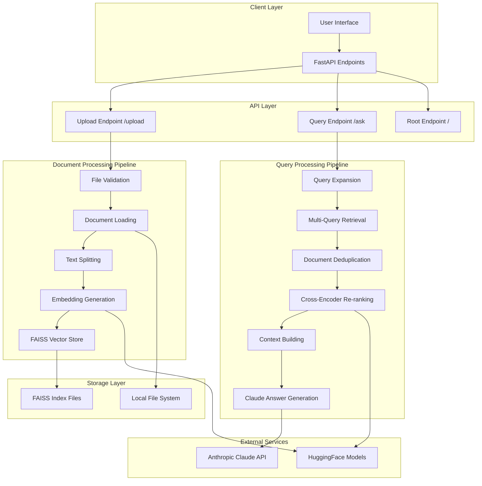

## 🔄 **Detailed Flow Diagrams**

### **1. Document Upload Flow**

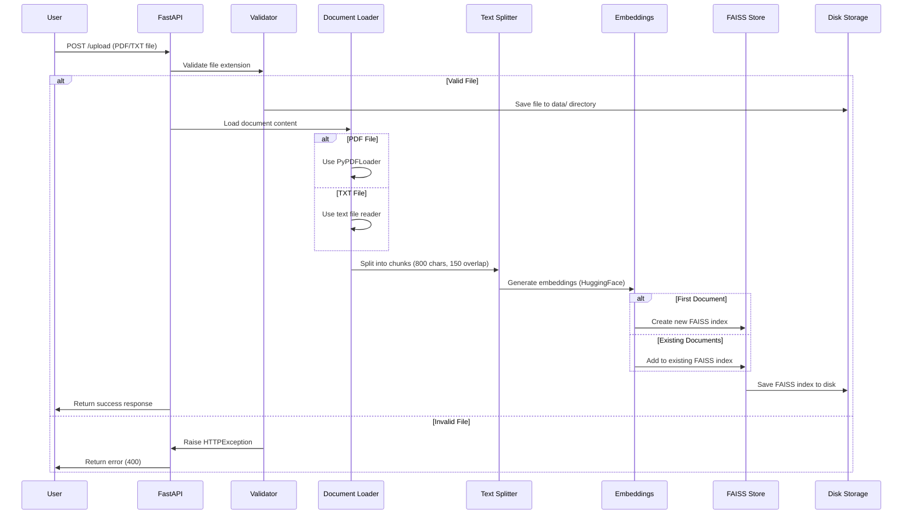

### **2. Query Processing Flow**

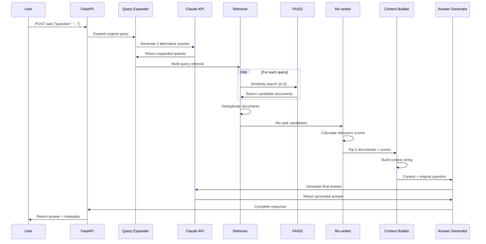

## 🏛️ **Component Architecture**

### **Core Components Breakdown**

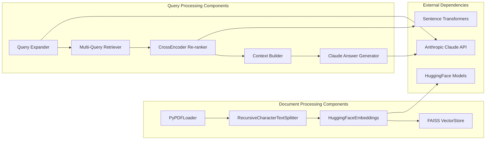

## 📋 **Detailed Code Analysis**

### **1. Key Configuration & Setup**

```python
# Core Models and Services
llm = ChatAnthropic(model="claude-sonnet-4-6")  # Main LLM
embeddings = HuggingFaceEmbeddings(model="all-MiniLM-L6-v2")  # Embeddings
reranker = CrossEncoder("cross-encoder/ms-marco-MiniLM-L-6-v2")  # Re-ranking
vector_store = None  # FAISS (initialized dynamically)
```

### **2. Document Processing Pipeline**

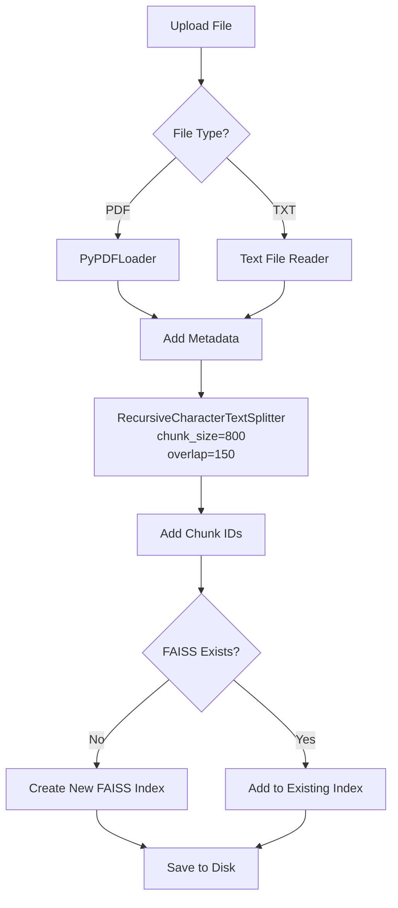

### **3. Advanced Query Processing**

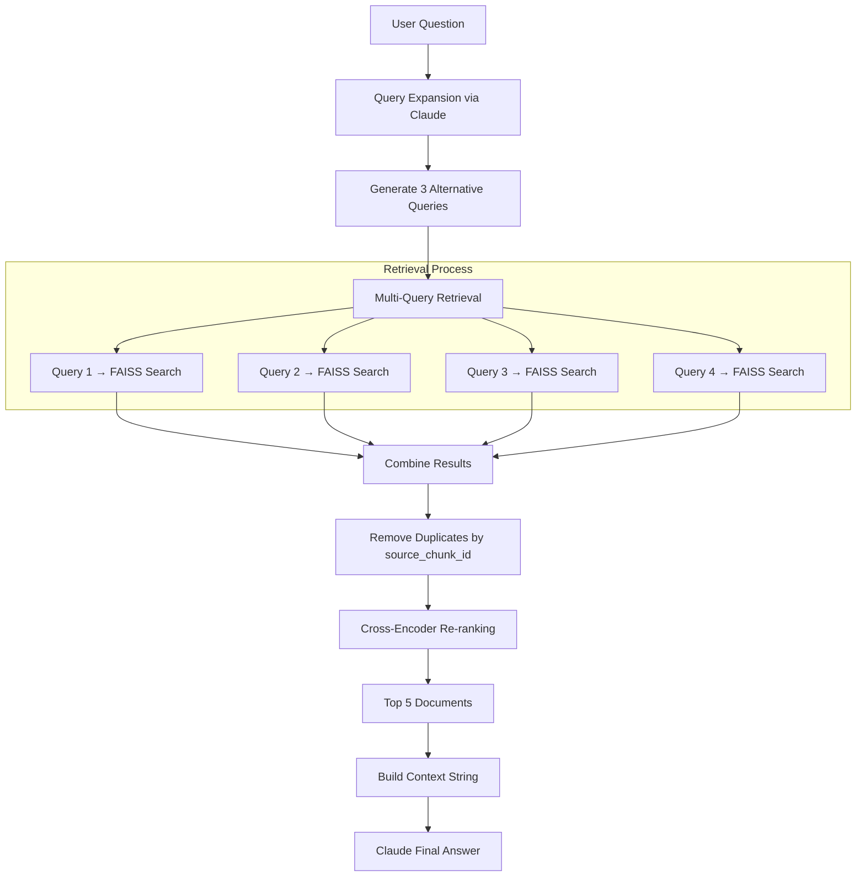

## 🔧 **Technical Implementation Details**

### **FAISS Vector Store Management**

```python
# Dynamic FAISS initialization
if vector_store is None:
    # First document: Create new index
    vector_store = FAISS.from_documents(documents=chunks, embedding=embeddings)
else:
    # Subsequent documents: Add to existing index
    vector_store.add_documents(documents=chunks)

# Persistence
vector_store.save_local(folder_path=FAISS_INDEX_PATH)
```

### **Query Expansion Strategy**

```python
def expand_query(question: str) -> List[str]:
    """
    Original: "What is Advanced RAG?"
    Expanded: [
        "What is Advanced RAG?",
        "Advanced Retrieval Augmented Generation",
        "Advanced RAG architecture", 
        "Advanced RAG retrieval techniques"
    ]
    """
```

### **Multi-Query Retrieval with Deduplication**

```python
def retrieve_candidates(queries: List[str], k: int = 5):
    """
    For each query:
    1. Search FAISS (k=5 results each)
    2. Combine all results
    3. Remove duplicates by unique key: f"{source}_{chunk_id}"
    """
```

## 📊 **Data Flow Architecture**

### **Document Ingestion Data Flow**

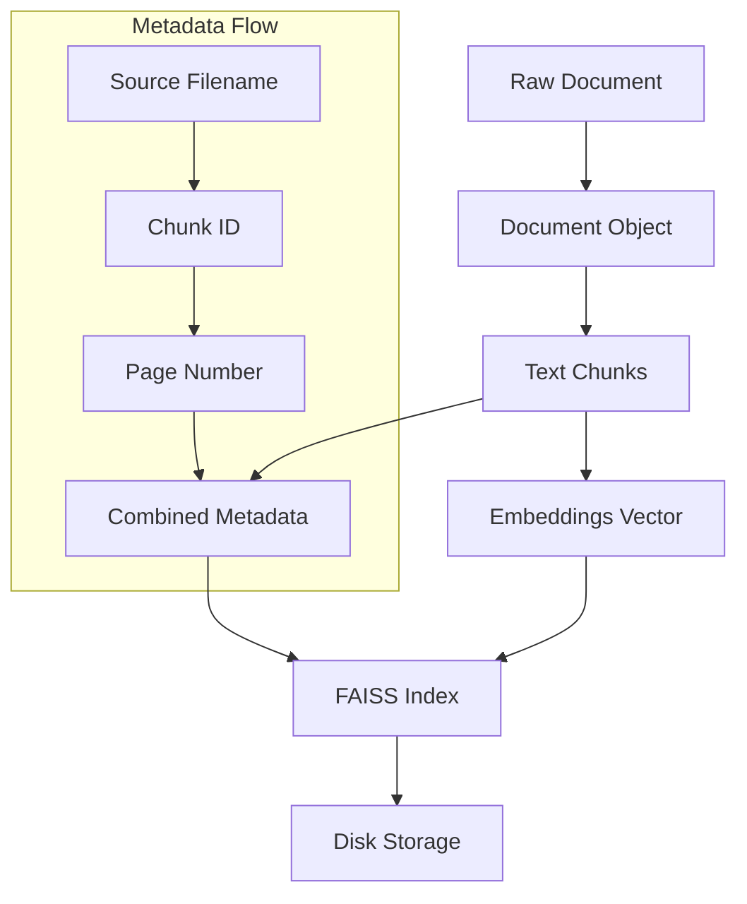

### **Query Response Data Flow**

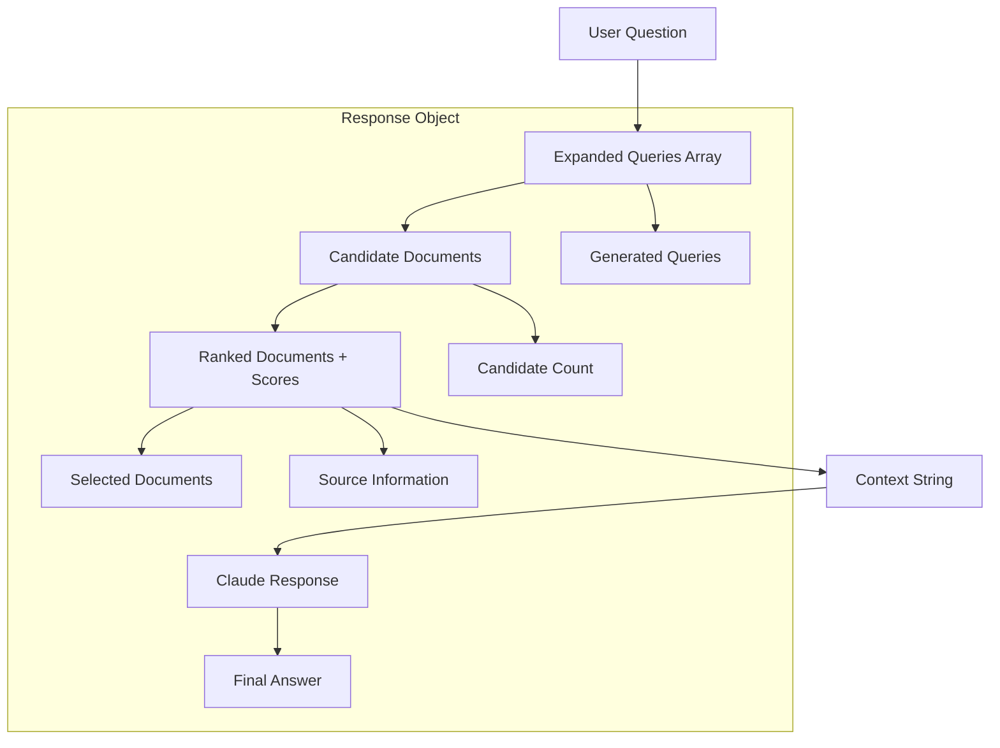

## 🎯 **API Endpoint Architecture**

### **Endpoint Structure**

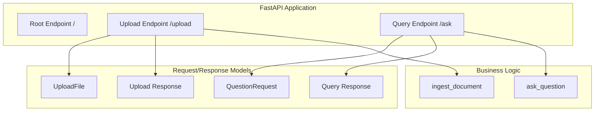

## 🔍 **Advanced Features Analysis**

### **1. Cross-Encoder Re-ranking**

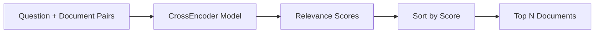

### **2. Context Building Strategy**

```python
# Context format for each document
"""
[Context 1]
Source: document.pdf, page 3
Content: <actual content>

[Context 2] 
Source: guide.txt
Content: <actual content>
"""
```

### **3. Error Handling & Validation**

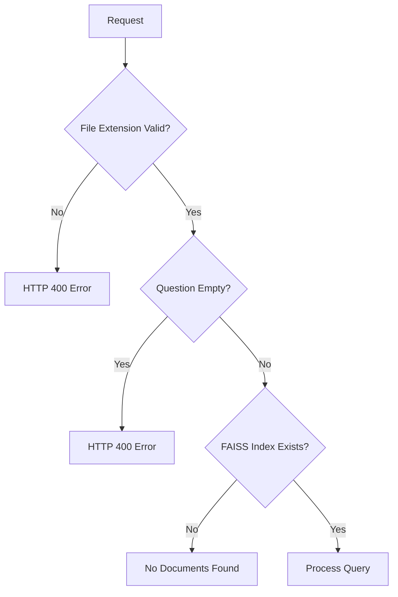

## 🚀 **Performance Considerations**

### **Optimization Points**

1. **FAISS Index**: Fast similarity search (O(log n))
2. **Chunk Overlap**: Ensures context continuity
3. **Re-ranking**: Improves relevance quality
4. **Query Expansion**: Increases recall
5. **Deduplication**: Reduces redundancy

### **Scalability Architecture**

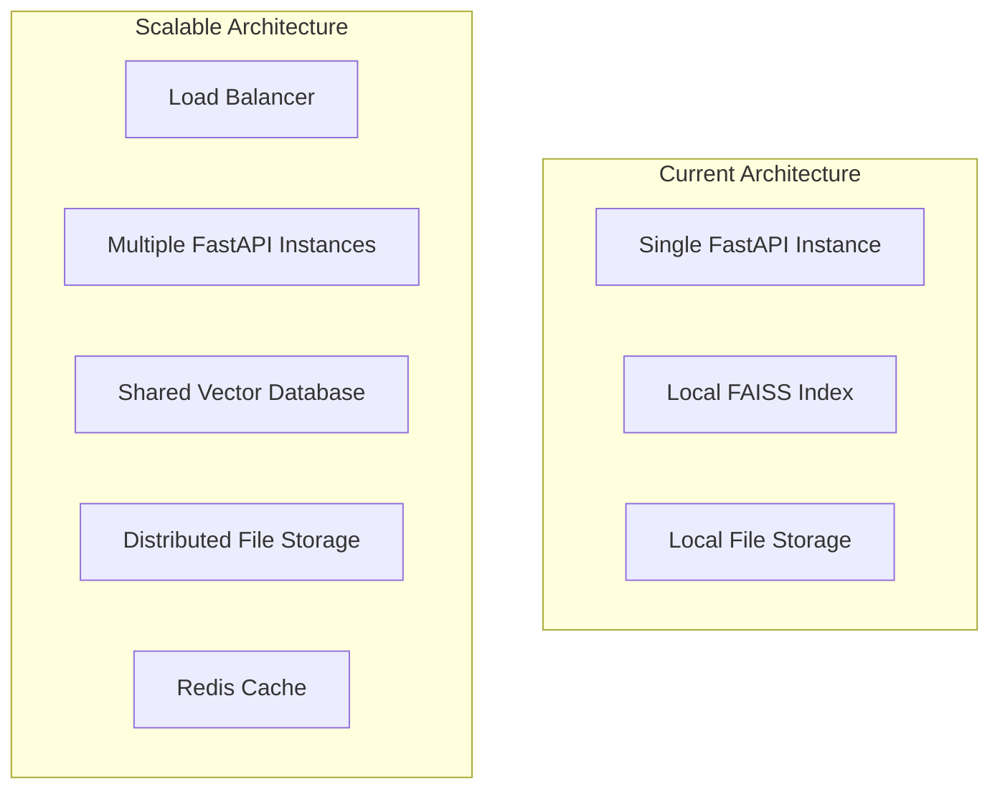

This architecture provides a robust, production-ready RAG system with advanced features like query expansion, multi-query retrieval, and cross-encoder re-ranking, all orchestrated through a clean FastAPI interface.
